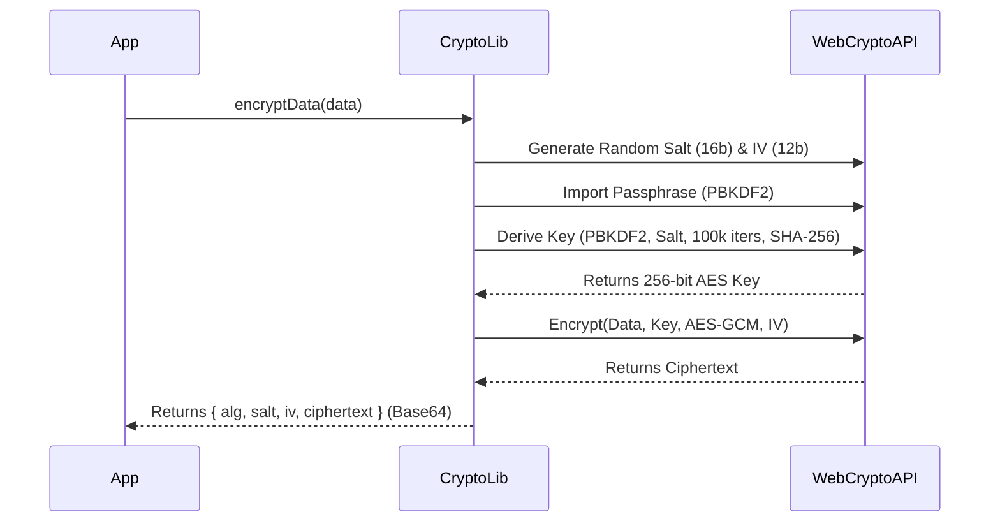

# Encryption Method Documentation: `src/lib/crypto.js`

This document outlines the encryption process used in the application, broken down into slide-ready sections.

## Slide 1: High-Level Overview

**Goal:** Securely encrypt data using industry-standard algorithms.

*   **Algorithm:** AES-GCM (Advanced Encryption Standard - Galois/Counter Mode).
*   **Key Derivation:** PBKDF2 (Password-Based Key Derivation Function 2).
*   **Security Features:**
    *   Randomized Salt (16 bytes) to prevent rainbow table attacks.
    *   Randomized IV (Initialization Vector, 12 bytes) to ensure uniqueness.
    *   High iteration count (100,000) for key derivation to resist brute-force attacks.

## Slide 2: Key Derivation (PBKDF2)

Before encryption, a strong cryptographic key is derived from a passphrase.

1.  **Input:**
    *   **Passphrase:** A secret string (loaded from environment variable: `process.env.NEXT_PUBLIC_PASSPHRASE`).
    *   **Salt:** A cryptographically random 16-byte value generated per encryption.
2.  **Process:**
    *   **Uses** PBKDF2 with **SHA-256** hashing.
    *   **Iterations:** 100,000 (slows down attacker attempts).
3.  **Output:**
    *   A **256-bit** AES-GCM key.

## Slide 3: The Encryption Process (AES-GCM)

Once the key is derived, the data is encrypted.

1.  **Inputs:**
    *   **Data:** The plaintext content to protect.
    *   **Key:** The 256-bit key derived in the previous step.
    *   **IV (Initialization Vector):** A random 12-byte value.
2.  **Algorithm:**
    *   **AES-GCM**: Provides both confidentiality (encryption) and integrity (authentication).
3.  **Result:**
    *   Produces the **Ciphertext** (encrypted data).

## Slide 4: Data Output Format

The final output is a JSON-compatible object containing everything needed for decryption (except the passphrase).

*   **`alg`**: `"AES-GCM+PBKDF2-SHA256"` (Metadata identifying the algorithm).
*   **`salt`**: Base64-encoded random salt (needed to reconstruct the key).
*   **`iv`**: Base64-encoded random IV (needed to decrypt).
*   **`ciphertext`**: Base64-encoded encrypted content.

---

### Sequence Diagram (Optional Visual)

